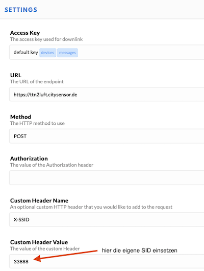

# MultiGeiger

Note: this is the doc translated to English from the German Markdown version.

<!---
Do not maintain this file, as it is old. Edit the *.rst files instead!
-->

It will be made available on https://multigeiger.readthedocs.io/ in English and
German on an ongoing basis.

# Ecocurious

The **MultiGeiger** is a project of Ecocurious, your community for environment, nature and technology, see https://ecocurious.de/projekte/multigeiger/.

The goal is to establish a citizen measurement network for radioactivity in Germany.

The **MultiGeiger** hardware and software were designed by Jürgen Böhringer (http://www.boehri.de).

Reinhard/rexfue has further developed the software, the board, and is taking care of the integration of the sensors into our map https://ecocurious.de/multigeiger-karte/.

We have started the first workshops where you can assemble the components and the case with our support.

Workshop dates can be found here:
 * https://www.meetup.com/de-DE/Ecocurious-deine-Umwelt-Natur-und-Technik-Community/
 * https://ecocurious.de/events/

Does this sound interesting to you? Then join us, we cordially invite you!

## Installation
Download and unpack the latest release from GitHub ( https://github.com/ecocurious/MultiGeiger/releases ) as source code (zip) or source code (tar.gz).
In the new directory, open the directory *multigeiger* and load the file *multigeiger.ino* with the Arduino IDE.

The board supports two different Heltec devices, different counting tubes and optionally a sensor for ambient temperature, air pressure, and humidity (BME280 or BME680).
The software can send data via network to different services.

 * **Heltec WiFi Kit 32**
This MCU has WiFi, a large display and plugged into the longer female connectors on the board.

 * **Heltec Wireless Stick**
This MCU has a very small display, and provides LoRa beside WiFi.
It must be plugged into the shorter female headers on the board.

To select the Heltec boards in the Arduino IDE, the following steps must be taken:
 * Add the file: https://raw.githubusercontent.com/espressif/arduino-esp32/gh-pages/package_esp32_dev_index.json in Preferences->Additional Boards Manager URLs. 
 * Then, the ESP32 boards (name "esp32 by Espressif Systems") can be installed under Tools->Board->Boards Manager.
 * Choose the correct Heltec board under Tools->Board. 
 * Select the **Heltec wireless Stick** for **both** boards. 
 * Select under Tools **Flash size: "4MB(32Mb)"** and **Partition Scheme: "Minimal SPIFFS (Large APPS with OTA) "**.
The software recognizes automatically which board is equipped. 


Various software settings can be made via the following files (see comments inside):

 * **./multigeiger/userdefines.h** (always necessary, an example is provided in userdefines-example.h)
 * **./platformio.ini** (only for platformio, an example is provided in platformio-example.ini)

All external libraries are required, which are listed in the file 
```
platformio-example.ini
```
under the section 
```
lib-deps =
```
Please install the latest version via platform.io / Libraries.

**Caution:** If the Arduino IDE is used, please check that in the file project_config/lmic_project_config.h (in the top level in this library) the correct configurations are set. The file must look like this:
```
// project-specific definitions
#define CFG_eu868 1
//#define CFG_us915 1
//#define CFG_au921 1
//#define CFG_as923 1
// #define LMIC_COUNTRY_CODE LMIC_COUNTRY_CODE_JP /* for as923-JP */
//#define CFG_in866 1
#define CFG_sx1276_radio 1
//#define LMIC_USE_INTERRUPTS
```
The specified versions of the libraries are the minimum requirements. We always test with the latest versions too, so please always install and use the latest versions.
If the compiler reminds other libraries, please install them in the Arduino IDE via *Sketch -> Include Library -> Manage Libraries ..*.

## Procedure after startup
The device establishes its own WiFi access point (AP). The SSID of the AP is **ESP32-xxxxxx**, where the xxx are the chip ID (or MAC address) of the WiFi chip (example: **ESP32-51564452**).
**Please write down this number, it will be needed later.**
This access point remains active for 30 sec. After that the device tries to connect to the (previously) defined WiFi netwword. This connection attempt also takes 30sec. If no connection could be established, the own AP is created again and the process starts again and again. 

## Configuring the device via WiFi network
After the WiFi AP of the device appears on your cell phone or computer, connect to it.
The connection asks for a password, it is **ESP32Geiger**.
The start page of the device opens usually **automatically**..
If the start page does not appear, you have to call the address **192.168.4.1** with a browser.
The start page appears, where you can't miss the link to the __configure page__ , click on it and you enter the settings page.


The settings page has the following lines:
 * Geiger accesspoint SSID\
 This is the SSID of the built-in AP and can be changed. If the sensor was already registered with this number at sensor.community (formerly: luftdaten.info), a new registration is mandatory.
 * Geiger accesspoint password\
 This is the password for the built-in AP.\
 It **MUST** be changed the first time. If desired, the default password **ESP32Geiger** can be used again. The field must not be left blank. Save the password to your favourite password manager. 
 * WiFi client SSID\
 Here you have to enter the SSID of the WLAN you want to connect for network/internet access.
 * WiFi client password\
 And here the corresponding password.

For more security, it is recommended to use a separate WiFi network (e.g. guest network) to ensure an isolated communication from the normal network.

If everything is entered, press **Apply** and the data are stored in the internal EEPROM. Leave this page via **Cancel**, because only in this way the program closes the Config-Mode and connects to the local WiFi network. If there is no **Cancel** Button, go back to the WiFi settings of the device and type in the normal home network parameters again.

**CAUTION**.
**When updating to version 1.13, the WiFi settings must be re-entered**. In future versions this step shall become obsolete.

Furthermore, the following options can be defined on the settings page:

* Start melody, speaker tick, LED tick and display on/off.
* Send data to sensor.community or/and to madavi.de
* If LoRa hardware is available: the LoRa parameters (DEVEUI, APPEUI and APPKEY) can be entered here.

The firmware on the MultiGeiger can be updated with the link __Firmware update__  at the End of the settings page.
Download the .bin file, select it via **Browse...** and click **Update**. It will take roughly 30sec for uploading and flashing the firmware.
If you see **Update Success! Rebooting...**, the MultiGeiger will reboot and the new firmware will be active.

If **Update error: ...** appears, the update did not work. The previous firmware is still active.


The settings page can be called up from your own WiFi at any time. To do this, just enter in the address bar of the browser: http://esp32-xxxxxxx (xxxxx is the chip ID -- see above). If it does not work with this host name, use the IP address of the Geiger counter instead. The Ip address can be found in the devices list in your router.
If successful, the login page appears. Enter **admin** as username and the chosen password (see above). Now you will see the settings page as described.

## Server
The pulses are counted for one measuring cycle at a time, from which the "counts per minute" (cpm) are calculated.
After each cycle the data is sent to the servers at *sensor.community* and at *madavi.de*.

At *sensor.community* the data is stored and made available for retrieval the next day as CSV file. This file can be found at http://archive.sensor.community/DATE/DATE_radiation_si22g_sensor_SID.csv),
where DATE = date in format YYYY-MM-DD (both times equal) and SID is the sensor number of the sensor (**not** the ChipID). For other sensors, replace the counting tube name **si22g** with the corresponding name (e.g.: sbm-20 or sbm-19).

At *madavi* the data is stored in a RRD database and can be accessed directly as a graph via this link:
https://www.madavi.de/sensor/graph.php?sensor=esp32-CHIPID-si22g.
Here CHIPID is the ChipId (the digits of the SSID of the internal access point).

During the transmission of the data to the servers, the name of the server is briefly shown in the status line (bottom line) of the display.

## Login to sensor.community (luftdaten.info)
In order to send the measuered data to sensor.community, it is mandatory to have a valid account and the sensor is registered. Both can be done at https://devices.sensor.community.
Create an account if you do not have one via the *Register* button and log in.
To register a new sensor click *Register new sensor*.
Fill in the form:
 * Sensor ID:\
 Enter the number (only the numbers) of the SSID of the sensor (e.g. for the sensor ESP-51564452 enter 51564452).
 * Sensor Board:\
 Select *esp32* (by the small arrows on the right)
 * Basic information:\
 Enter the address and the country. The internal name of the sensor can be assigned arbitrarily, but must be entered. Please check **Indoor sensor** as long as the sensor operates not outdoor.
 * Additional information:\
 Can be left blank, but its nice to provide further information.
 * Hardware configuration:\
 Select the sensor type **Radiation Si22G** (or accordingly). The value for the second sensor can remain DHT22, as it is irrelevant in this context.
 * Position\
 Please enter the coordinates as accurate as possible. You can use the right button to calculate the coordinates. They are needed to show your sensor on the map.

Finish the settings by clicking *Save settings*. 
At the overview page for this sensor go to *Data*. Here you see amongst others the ID of the sensor. Please remember: the ID mandatory for the queries at sensor.community or multigeiger.citysensor.de.

## LoRa interface
The MultiGeiger can be connected with the followng steps to TTN ("The Things Network"):

* Create the TTN device in your profile at *The Things Network* 
* Transfer the parameters to the multi-pointer
* Login at *sensor.community* (former luftdaten.info)
* HTTP integration


### Creating a TTN device
The device must be registered with TTN. To do this, an account must first be created at TTN (if one does not already exist).

#### Create TTN account
At <https://account.thethingsnetwork.org/register> you have to enter a **USERNAME**, the **EMAIL ADDRESS** and a **PASSWORD**. Then right down over **Create account** create the account. After that you can log in to the console with the new data (<https://account.thethingsnetwork.org/users/login>).

#### Create application
After you have logged in successfully, create the new application via **APPLICATIONS** and **add applications**. The following fields must be filled in:

* **Application ID:**\
Any name for this application, but it must not yet exist in the network (e.g.: geiger_20200205).
* **Description:**\
Any description of the application can be entered here.
* **Application EUI:**\
Remains empty, the number is generated by the TTN system.
* **Handler registration:**\
The pre-filled value (ttn-handler-eu) is already correct and remains.

Now add the application with **Add application** in the lower right corner.

#### Create device
Finally, the device has to be created. To do this, select the newly created application in the overview of applications (click). Then in the middle area at **DEVICES** start the creation of a new device via **register device**. The following fields must be filled in:

* **Device ID:**\
Any name for the device. It must be unique within the application (e.g.: geiger_01) and consist only of lower-case letters.
* **Device EUI:**\
Click once on the symbol on the far left of the line, then the text appears that this number is generated by the system. We don't have to enter anything else.
* **App Key:**\
No input necessary
* **App EUI:**\
Stays like this

Click on **Register** in the lower right corner. Congratulations, the device is created.

### Modifying the LoRa parameters
After the registration was completed, the LoRa parameters can be transferred to the program.\
They can be set up at the configuration site of the Geiger counter (see above).

Go through the configuration site until the settings of the LoRa parameters are displayed. Type in the 3 parameters from the TTN console (**APPEUI, DEVEUI, APPKEY**). 
They can be found in your TTN account for each device (see above). The HEX values must be entered **without** spaces as they appear in the TTN.
Example:\
The TTN console reads
```
Device EUI 00 D0 C0 00 C3 19 7C E8
```
Then the following must be entered:

```
00D0C000C3197CE8
```
This is also applies to **APPEUI** and **APPKEY** .

### Logging data into sensor.community (formerly luftdaten.info)
If you want the MultiGeiger to pass recorded data to *sensor.community* via TTN, you have to register it.
The registration is similar to the TTN registration described above. In the following, only the changes are explained:

 * Sensor ID:\
 Enter the last 4 bytes of the DEVEUI in left to right order (e.g. if the DEVEUI is *00 D0 C0 00 C3 19 7C E8*, so enter *C3197CE8*), but converted to decimal, not in HEX (finally: 3273227496).
 * Sensor Board:\
 Select **TTN**, using the small arrows on the right.
 

### HTTP integration
To get the data from TTN to *sensor.community* you have to enable the HTTP integration at TTN.
In the TTN console click *Applications* and then click on the application of the GeigerCounter (e.g. *geiger_20200205*). On the top right in the bar with *Overview*, *Devices*, *Payload Formats*, *Integrations*, *Data*, *Settings* click **Integrations**. Then select **HTTP Integration** via **add integration**.

Now fill in the displayed fields:\
 **Process ID**\
 	Enter any name for this integration here
 **Access Key:**\
 	Click here once and select the *default key*\
 **URL:**\
 	Enter the URL for the ttn2luft program: <https://ttn2luft.citysensor.de>\
 **Method:**\
 	If it reads already *POST*, don't touch it\
 **Authorization:**\
 	remains empty\
 **Custom Header Name:**\
 	here comes the text **X-SSID** pure\
 **Custom Header value:**\
 	Enter the SSID of the sensor (the number you got when you registered at sensor.community, *NOT* the chip ID).

Click **Add integration** in the lower right corner to confirm the changes.\
See this example how the form should look like :\


### TTN payload (example)
In order to get readable values in the TTN console instead of solely data bytes, a small script can be inserted as payload decoder.\
Go to the TTN website, log in, click **Applications** to find the application you created above. Select the tab **Payload Formats** in the menu bar and paste the following code into the field. Existing code will be overwritten):

```
function Decoder(bytes, port) {
  // Decode an uplink message from a buffer
  // (array) of bytes to an object of fields.
  var decoded = {};
  if(port == 1) {
  decoded.counts = ((bytes[0]*256 + bytes[1]) * 256 + bytes[2]) * 256 + bytes[3];
  decoded.sample_time = (bytes[4] * 256 + bytes[5]) * 256 + bytes[6];
  decoded.tube = bytes[9];
  var minor = (bytes[7]&0xF)+(bytes[8]>>4) ;
  decoded.sw_version="" + (bytes[7]>>4) + "." + minor + "." + (bytes[8]&0xF);
  }
  if (port === 2) {
    decoded.temp = ((bytes[0] * 256 + bytes[1]) / 10) + "°C";
    decoded.humi = bytes[2] / 2 + "%";
    decoded.press = ((bytes[3] * 256 + bytes[4]) / 10) + "hPa";
  }
  return decoded;
}
```
