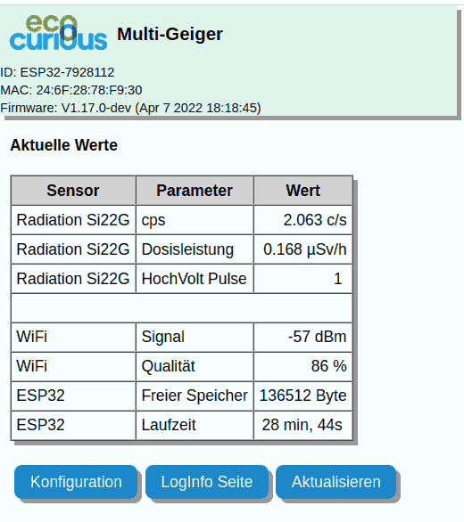
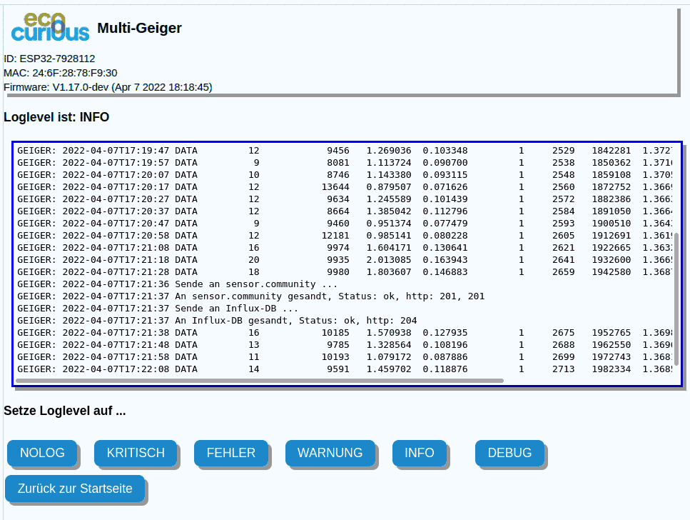
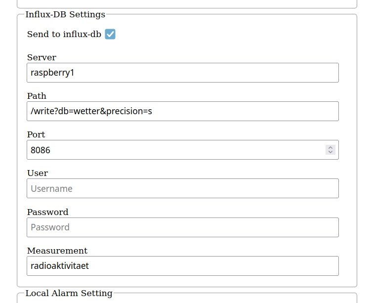

# Fork of MultiGeiger
# Adoptions in this fork:
this fork is based on the master branch of the original MultiGeiger software (https://github.com/ecocurious2/MultiGeiger.git) as of 08.04.2022 (Firmware V1.17.0-dev)

# Motivation:
Having a Air Quality sensor from the Luftdaten project (sensor.community) installed, I know about problems with dropping Wifi connections, memory leaks,
interrupted data transfer to the internet portals, etc.
And I also know, without being able to monitor my sensor outside at its final installation position, I would have been lost.

E.g. to search a good installation position outside, I use a power bank for the sensor and my cellphone to display the 'Actual Values' page, and I directly see the Wifi quality.

Then you install it there in a provisional manner and watch the values from inside via Wifi for a couple of days.

If sending to the portals fails, you can see the http return code on the log page.

You can actually monitor all values which are normally sent to the serial port via the log info page via WiFi now,
no need to connect a laptop anymore via USB (which would imply a restart, resetting the sensor, which could solve/hide an actual problem ) ...

As long as you have WiFi, you can monitor your Sensor, even if your Internet connection is broken down.

I have an Influx-DB running here on a raspberry, where I log all my weather data locally. Of course I wanted to include this sensor as well.

This fork bascically ports some functionality from the 'Luftdaten-Sensor' (sensor.community) to the MultiGeiger,
with some simplifications and enhancements in the code ...

It does NOT touch the original code concerning gathering the data from the tube, etc. This is all untouched !

Nicola from the ecocurious team was so nice to share the ecocurious logo for this fork.

# This implementation adds :
  * local html pages which are accessible via WiFi. Just connect to the sensor in your WLAN and you're on the first page ...

    * first page is showing actual sensor values (Dose rate, cps, HV pulses), Wifi-Data (Signal/Quality), free Memory, Firmware Version & Date …

         

        * if BME280/680 is available, it also shows temperature, humidity & pressure

        * the page refreshes automatically every 10s

    * second page shows log infos which are normally only available through serial connection

        

        * the loginfo is updated automatically in the central frame and can be scrolled

        * The loglevel can be changed temporarily (runtime, not saved)

  * a configurable http connection to a influx database included in the original configuration page

      

  * (extendable) translation system for the texts displayed on the local WLAN pages.

    * Languages DE, EN and IT are available already.

    * Preferred language to be set on compile time

  * in the configuration page where Text attributes were showing only '?????' upon first run.

# Compilation :

I use 'VS code' and platformio for compilation, upload and monitoring (I'm working under Fedora).
* You can copy the platformio-example.ini to platformio.ini, compile one of the (currently) 3 language options, and upload it.
* The only thing to be adopted in platformio.ini is probably upload_port & monitor_port
* Necessary libraries should be pulled in automatically.
* Furthermore you have to copy userdefines-example.h to userdefines.h and adopt the content before compilation.

I have only experience with the WiFi version of this sensor, so the pages will not be visible on the LoRaWan sensor option due to missing WiFi (I guess).

