.. include:: global.rst.inc
.. _assemblyguide:

Assembly Guide
==============

.. Die erste Version dieser Anleitung stammte von einem Handout von Jürgen Böhringer mit dem Titel ``Wie baue ich einen Multigeiger?`` (damals: HW-Version V1.4 jb/rxf 2019-09  -  Handout-Version 2021-03-03)

Ergebnis
########
Das Multigeigerprojekt ist eine Idee der `Ecocurious-Initiative <https://ecocurious.de/projekte/multigeiger-2/>`_.
Das dazugehörige Open-Source Multigeigermessgerät zum Messen radioaktiver Gammastrahlung wird von der Community entwickelt.
Die Echtzeitdaten der stationären Geräte werden per LoRaWAN oder WiFi/WLAN an einen Server gefunkt und auf einer `Karte <https://ecocurious.de/multigeiger-karte/>`_ visualisiert. 
So entsteht ein Radioaktivitätsmessnetz in Bürgerhand, das wir hiermit aufbauen wollen.
Herzliche Einladung zum Mitmachen!

.. image:: images/build_01_final.jpg
   :width: 100%

Bauteile
########

Bauteile (s. `Stückliste <https://github.com/ecocurious2/MultiGeiger/blob/master/docs/hardware/MultiGeiger_Partlist.ods?raw=true>`_) zunächst sortieren und auf Vollständigkeit prüfen:

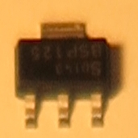

.. |parts02| image:: images/build_02_parts_02.jpg
   :width: 200px

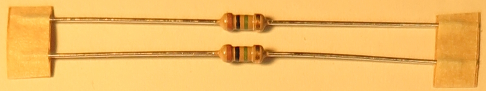

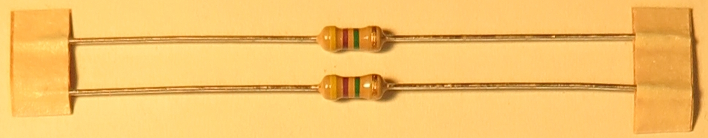

.. |parts05| image:: images/build_02_parts_05.jpg
   :width: 200px

.. |parts06| image:: images/build_02_parts_06.jpg
   :width: 200px

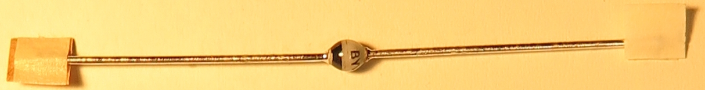

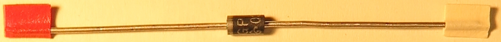

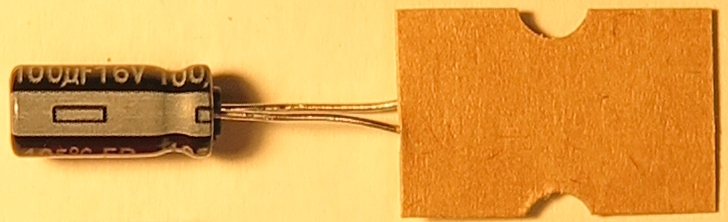

.. |parts10| image:: images/build_02_parts_10.jpg
   :width: 100px

.. |parts11| image:: images/build_02_parts_11.jpg
   :width: 150px

.. |parts12| image:: images/build_02_parts_12.jpg
   :width: 70px

.. |parts13| image:: images/build_02_parts_13.jpg
   :width: 150px

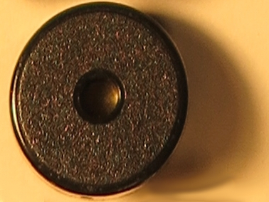

.. |parts15| image:: images/build_02_parts_15.jpg
   :width: 180px

.. |parts16| image:: images/build_02_parts_16.jpg
   :width: 200px

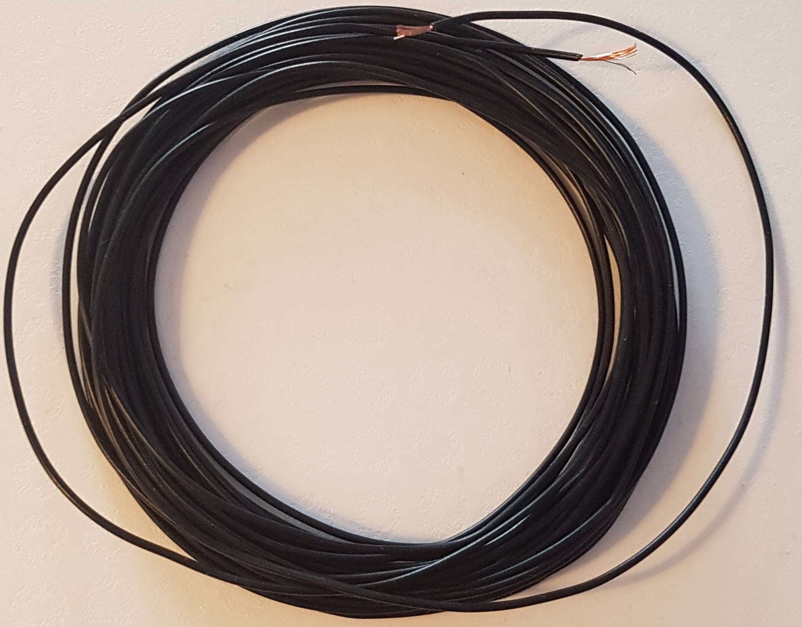

+-------+---+------------------------------------+------------------------------------------+
| ID(s) | # | Bild                               | Typ                                      |
+=======+===+====================================+==========================================+
| T1    | 1 | |parts01|                          | N-MOS-Transistor BSP125                  |
+-------+---+------------------------------------+------------------------------------------+
| R1    | 1 | |parts02|                          | 10K Widerstand braun-schwarz-orange-gold |
+-------+---+------------------------------------+------------------------------------------+
| R2 R5 | 2 | |parts03|                          | 1,0M Widerstand braun-schwarz-grün-gold  |
+-------+---+------------------------------------+------------------------------------------+
| R3 R4 | 2 | |parts04|                          | 4,7M Widerstand gelb-violett-grün-gold   |
+-------+---+------------------------------------+------------------------------------------+
| D1 D2 | 2 | |parts05|                          | Z-Diode ZY 200                           |
+-------+---+------------------------------------+------------------------------------------+
| D3    | 1 | |parts06|                          | Z-Diode BZX55C3V3                        |
+-------+---+------------------------------------+------------------------------------------+
| D4    | 1 | |parts07|                          | Gleichrichterdiode BYV 26E               |
+-------+---+------------------------------------+------------------------------------------+
| D6    | 1 | |parts08|                          | Gleichrichterdiode GP10Y                 |
+-------+---+------------------------------------+------------------------------------------+
| C1    | 1 | |parts09|                          | ELKO Elektrolytkondensator 100 uF, 16 V  |
+-------+---+------------------------------------+------------------------------------------+
| C2    | 1 | |parts10|                          | Folienkondensator 10nF, 100V 0.01  100-  |
+-------+---+------------------------------------+------------------------------------------+
| C3    | 1 | |parts11|                          | Folienkondensator 100nF, 630V 0.1  630-  |
+-------+---+------------------------------------+------------------------------------------+
| C4    | 1 | |parts12|                          | Folienkondensator 100pF, 1000V 100/1000- |
+-------+---+------------------------------------+------------------------------------------+
| L1    | 1 | |parts13|                          | Spule 150uH 154J                         |
+-------+---+------------------------------------+------------------------------------------+
| Pz1   | 1 | |parts14|                          | Piezo-Lautsprecher                       |
+-------+---+------------------------------------+------------------------------------------+
| X1 X2 | 2 | |parts15|                          | Zählrohrhalter                           |
+-------+---+------------------------------------+------------------------------------------+
|       | 2 | |parts16|                          | Buchsenleiste Microcontroler-Modul       |
+-------+---+------------------------------------+------------------------------------------+
|       | 2 | |parts17|                          | Je 30 cm isolierte Kupferlitze           |
+-------+---+------------------------------------+------------------------------------------+

Lötarbeiten
###########

Feldeffekt-Transistor T1
------------------------

Als erstes Bauteil wird das einzige Bauteil im SMD-Bauform montiert. Mit Klebeband (Kreppband hat sich bewährt) wird er so auf die Platine geklebt, so dass die drei Pins sichtbar sind. 
Dann werden die vorderen Anschlüsse verlötet, das Klebeband vorsichtig entfernt und der hintere Anschluss verlötet. 

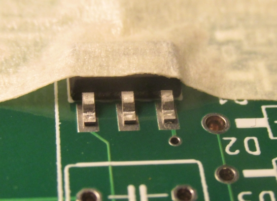

Widerstände und Dioden
----------------------

Die Widerstände und Dioden werden alle in einer Abbiegevorrichtung (oder entsprechend mit der Hand oder einer kleinen Zange) gebogen.
Die Breite ist immer 4 Einheiten – sprich ca. 10 mm.

.. image:: images/build_04_bending.jpg
   :width: 70%

Anschließend wird die Platine mit den Widerständen und Dioden bestückt. Bei den Dioden unbedingt auf die Polarität achten! Die Kathode (Minus-Pol) ist mit einem Strich auf Platine und Bauteil markiert.

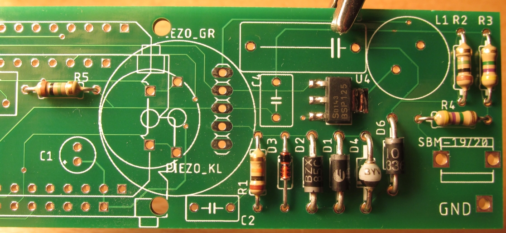

Vor dem Löten der Unterseite werden die Bauteile auf der Oberseite mit Klebeband fixiert, oder die Beinchen der Bauteile durch leichtes Auseinanderbiegen verklemmt.
Dann Bauteile anlöten, Klebeband entfernen und überschüssigen Draht abschneiden. 

.. note:: Verletzungsgefahr: Beim Abschneiden darauf achten, dass der davonfliegende Draht niemanden verletzten kann. Möglichst festhalten beim Abschneiden!

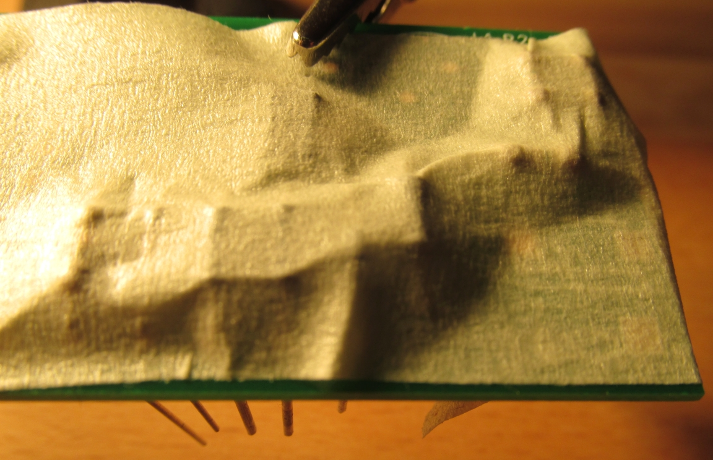

Kondensatoren und restliche Bauteile
------------------------------------

Der Elektrolytkondensator (Elko) wird vorher mit einer Flachzange angewinkelt. Beim Elko unbedingt auf die Polung achten: 
Auf dem Elko ist der „–“-Pol markiert, auf der Platine der „+“-Pol. Die Beschriftungen müssen sich gegenüber liegen.
Der Zählrohrhalter muss so herum eingesetzt werden, dass das Zählrohr nach außen steht kann – am besten testen! Dann die Bauteile mit Klebeband fixieren, anlöten und den überschüssigen Draht abschneiden. 

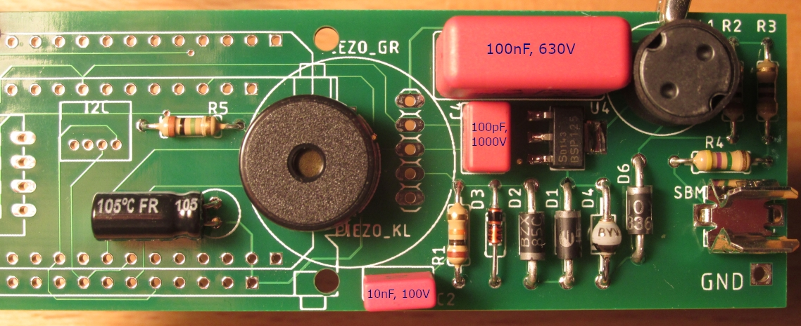

|build07|
Kondensatoren, Zählrohrhalter, Spule, Piezo-Lautsprecher sind bestückt

Buchsenleisten und Mikrocontroller-Modul
----------------------------------------

Die Buchsenleiste muss vorher evtl. noch gekürzt werden. 

.. note:: Dabei muss der Seitenschneider genau auf dem **letzten nicht mehr benötigten Kontakt** angesetzt werden – **nicht dort wo man ihn eigentlich kürzen will** – ansonsten kann sie splittern.
   Beim Abschneiden wegfliegende Teile möglichst festhalten!

.. image:: images/build_08_soldering_femaleConnectorStrip.jpg
   :width: 50%

Wird der große Piezo-Lautsprecher verwendet, so sollte die Buchsenleiste mit einer Feile etwas abgefeilt werden (vorher ausprobieren).
Am einfachsten geht das an der originalen, nicht bearbeiteten Seite der Buchsenleiste. Je nachdem, welches Mikrocontroller-Board verwendet wird, müssen die Buchsenleisten an den entsprechenden Stellen bestückt werden.

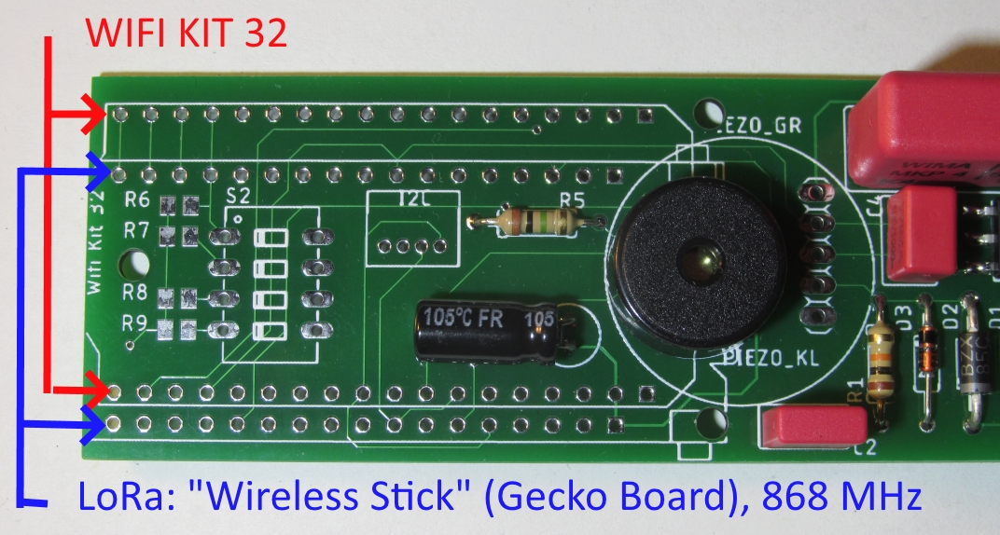

Die Winkel der Buchsenleiste sollten genau stimmen. Daher am besten so vorgehen:

* Die erste Buchsenleiste einstecken
* Von unten her eine Lötstelle in der Mitte löten, die Lötstelle nochmals heiß machen und gleichzeitig die Buchsenleiste justieren (rechter Winkel, alle Pins richtig)
* Die zweite Buchsenleiste einstecken
* In beide Buchsenleisten die Stiftleiste aus dem Mikrocontroller-Modul-Set einstecken, so dass deren längerer Teil der Stiftleiste in der Buchsenleiste steckt
* Das Mikrocontroller-Modul aufstecken, so dass das Display sichtbar ist und die Mikro-USB-Buchse über dem Piezo-Lautsprecher liegt
* Alles mit einem schmalen Klebeband fixieren (siehe Bild unten), so dass alle Lötstellen zugänglich sind
* nun können alle Kontakte gelötet werden 

.. note:: Das OLED-Grafikdisplay ist über eine dünne Flex-Leitung angeschlossen, die nicht zu heiß werden darf. Im Zweifel lötet man die Pins in der Nähe der Flex-Leitung nicht an – sie werden nicht benötigt.

.. image:: images/build_10_soldering_femaleConnectorStripESP32withTape.jpg
   :width: 100%

Nach dem Löten kann das Mikrocontroller-Modul mit wippenden Bewegungen vorsichtig abgezogen werden.

* Beim Mikrocontroller-Modul sind Pin-Beschriftungsaufkleber mit dabei. Diese können jetzt seitlich aufgeklebt werden. Welcher Pin wo ist, steht auf der Unterseite des Mikrocontroller-Moduls.
* Das Kabel für den Anschluss der Zählrohr-Kathode (Minus-Anschluss) an Klammer und Platine anlöten.
* Kabel mit jeweils einem Tropfen Heißkleber sichern (Zugentlastung)
* Sichtkontrolle (hast du Lötstellen vergessen, sind Lötbrücken entstanden, …)
* Mikrocontroller-Modul wieder aufstecken
* Zählrohr anklemmen: der Plus-Pol (Anode) ist markiert und muss in Richtung Platine zeigen
* Erste Funktionskontrolle

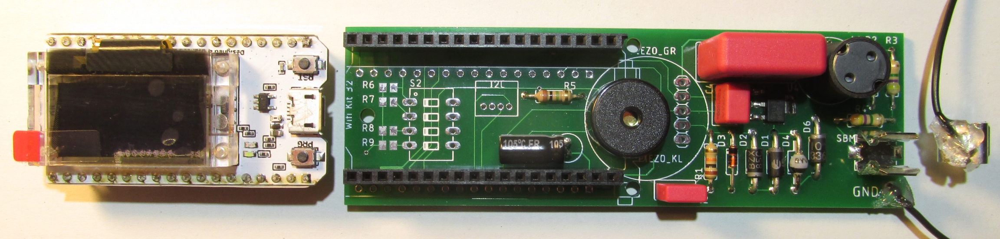

|build11|
Fertige Geigerzähler- und Mikrocontrollerplatine

.. note:: Das dünne Glas des OLED-Grafikdisplays ist empfindlich. Bitte keine Kraft darauf ausüben, sondern nur auf der Mikrocontrollerplatine!

.. warning:: Verletzungsgefahr: Auf der Geigerzählerplatine wird eine **Spannung von 400 Volt** erzeugt. 
   Diese hält sich auch noch längere Zeit **nach dem Ausschalten des Geräts**. Bei Berührung kann es zu kleineren Stromschlägen kommen, die normalerweise harmlos sind. Dennoch sollten sie vermieden werden! 

   .. image:: images/build_12_highVoltageWarningSign.png
      :width: 70%

   **Man sollte vor dem Arbeiten an der Schaltung den Kondensator entladen.** 
   Am einfachsten macht man dies mit einer zweiten, ca. 30cm langer Leitung, mit der man Anode und Kathode des Zählrohrs für etwa eine Sekunde kurzschließt. 
   Dies schützt nicht nur vor unangenehmen Stromschlägen, sondern schützt auch die empfindliche elektronische Schaltung.

Gehäuse
#######

Funktionen des Gehäuses
-----------------------

* Es schützt die Elektronik vor Umwelteinflüssen (z. B. Regen) und Insekten (daher sollte kein Zugang von außen zur Elektronik größer sein als 0,5 mm).
* Es hält das Zählrohr in einer Höhe von 1 m über der Wiese – somit sind unsere Messwerte (bestmöglich) vergleichbar zu denen des amtlichen `ODL-Messnetzes <https://odlinfo.bfs.de/DE/index.html>`_.

Rohre
-----

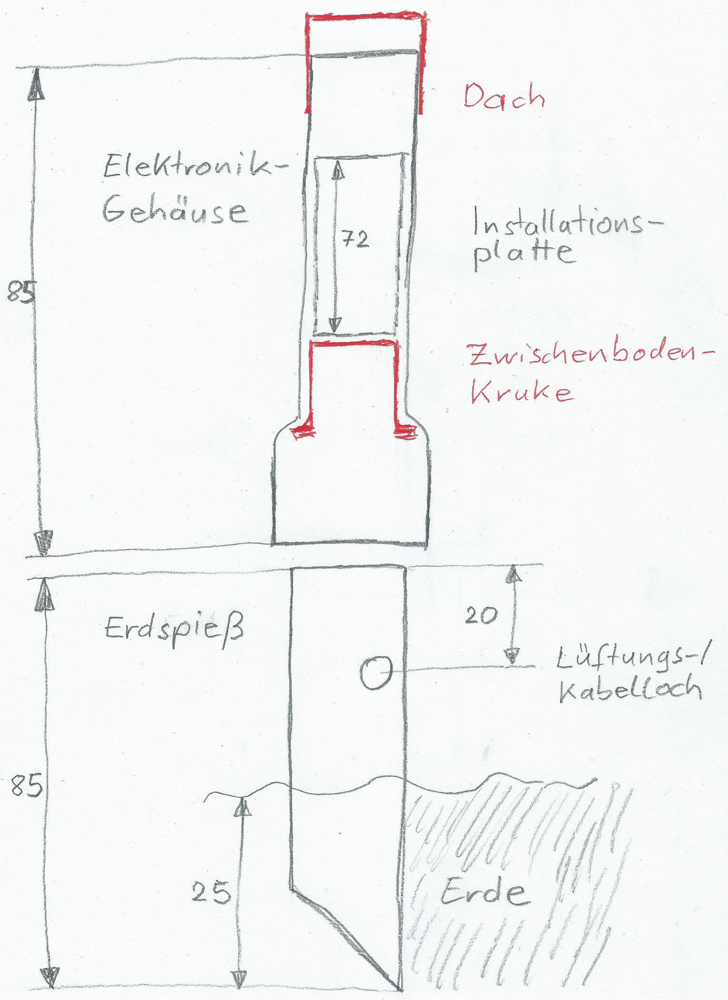

* Rohr für das Elektronikgehäuse: Zunächst wird das Rohr mit einer Säge auf entsprechende Länge abgesägt.
  Die Muffe (Aufweitung) zeigt nach unten.
* Rohr für den Erdspieß: Der noch umgesägte Teil des Restes ist das obere Ende des Erdspießes.
  Unten wird der Erdspieß auf entsprechende Länge abgesägt im 45-Grad-Winkel. 
  Mit diesem schrägen Anschnitt lässt sich der Erdspieß später mit leichten Drehbewegungen gut in die Erde bohren. 
  Alternativ kann man diesen Teil des Rohrs kurzhalten (ca. 15cm) und in einem verzinkten Sonnenschirmhalter mit Erdspieß (Ø40mm) festklemmen.
* Lüftungs-/Kabelloch bohren: Mit einem Reißnagel o. ä. wird das Loch seitlich im Erdspieß vorgestochen. 
  Anschließend wird es aufgebohrt. Zuletzt wird es mit einem großen Bohrer / Schälbohrer auf etwa 17 mm Durchmesser aufgebohrt. 

.. note:: Verletzungsgefahr: Mit der Klinge/dem Bohrer immer nach außen, d.h. vom Körper weg, schneiden oder bohren!

Dach und Zwischenboden
----------------------

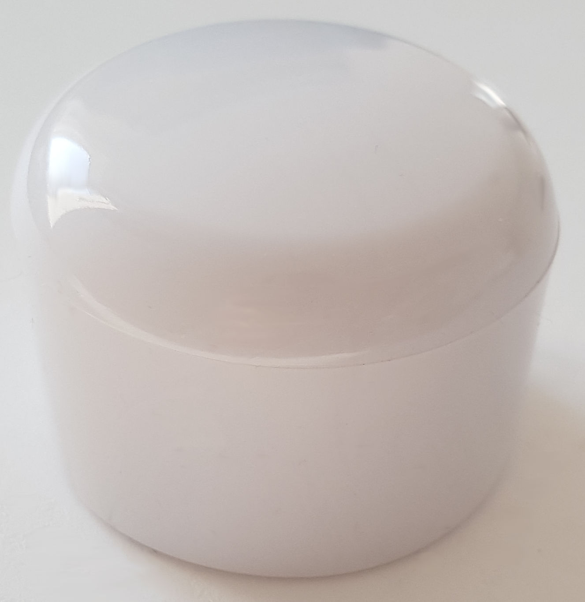

Für das Dach kann man einen Rohrabschlussstopfen oben vorsichtig über das Rohr schieben, s. Bild rechts.

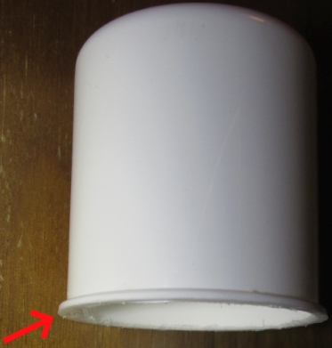

Als Zwischenboden verwenden wir eine Kruke, also eine Plastikdose, die in Apotheken zum Abfüllen von Salben verwendet wird.
Der rote Deckel kann als Material für eine kabeldurchführungsverkleinernde Zwischenbodenauflage dienen.

Für den Zwischenboden (s. Bild links) wird lediglich das Gewinde vorsichtig mit der Säge abgesägt. Der „Kragen“ muss bestehen bleiben, da er als Anschlag dient.

In den Zwischenboden wird in der Mitte ein Loch zur Kabeldurchführung mit 10 mm gebohrt. Der Stecker des Kabels muss durch das Loch passen.

.. Auskommentiert, da die Variante mit Deckel viel einfacher ist
  Bei Verwendung einer Kruke als Dach wird der „Kragen“ unter dem Gewinde mit abgesägt, so dass die Dachkruke oben genau in das Rohr hineinpasst:

  .. image:: images/build_14_bottle_top.jpg
     :width: 30%
     :align: left
     :alt: Deckel zum Einkleben

  Das obere Viertel der Dachkruke wird seitlich mit Silikonklebstoff benetzt und in das obere Teil des Elektronikgehäuses geschoben. Die Fuge wird weiterhin mit Silikonklebstoff abgedichtet. 

  Auch der obere Rand der Dachkruke wird mit Klebstoff benetzt (s. Skizze). Um ein Hereinrutschen zu verhindern, kann man sie von unten mit einem langen Gegenstand fixieren. 
  Die Silikonfuge kann man glätten, indem man einen Finger mit Spülmittel benetzt und damit das „Dach“ glättet. 

.. Ab hier nicht mehr auskommentiert die Anleitung zur Auflage:

Eine Zwischenbodenauflage dient zum Schutz vor Insekten, da sie das Loch der Kabeldurchführung verkleinert. Man kann dafür z. B. den roten Deckel der Kruke oder ein ähnliches Stück Kunststoff verwenden.

Es wird die Mitte markiert und dort ein Loch mit dem Durchmesser des Stromkabels (ca. 5 mm) gebohrt. Anschließend werden die Ecken abgeschnitten. Zusätzlich wird ein Verbindungsschlitz von außen zum Loch geschnitten.

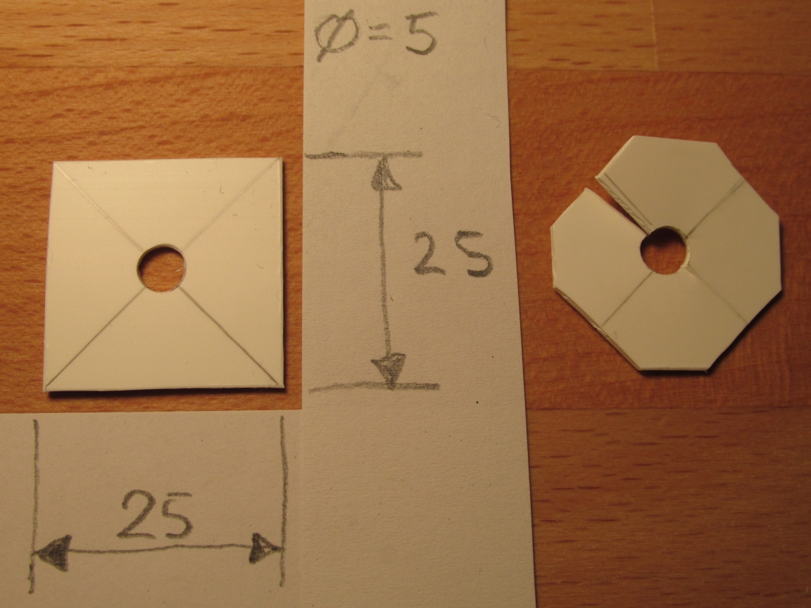

|build15|
Aufbau der Zwischenbodenauflage (in zwei Arbeitsschritten)

Installationsplatte
-------------------

* Die Installationsplatte kann aus dem Ober- oder Unterteil eines Kabelkanals gefertigt werden. 
  Dazu werden die Seitenteile vorsichtig mit einem Messer abgeschnitten.
  Danach wird der dadurch entstandene, biegsame Kunststoffstreifen auf die richtige Länge gebracht. Hierzu kann eine starke Schere verwendet werden.
* Löcher durch Installationsplatte bohren: Elektronik und Zählrohr werden so mit Kabelbindern auf Installationsplatte fixiert, dass das Zählrohr sich auf 1 m Höhe befindet, wenn der Erdspieß 25 cm in der Erde steckt. 
  Das Zählrohr zeigt nach unten. Die Löcher werden mit dem Reißnagel vorgestochen und dann auf 3 mm aufgebohrt (s. Bild „Bohrplan Installationsplatte“)
* Die Platine wird lediglich mit einem Kabelbinder auf der Platte montiert, der durch beide Löcher gezogen wird. Er verläuft unterhalb des USB-Steckers. 

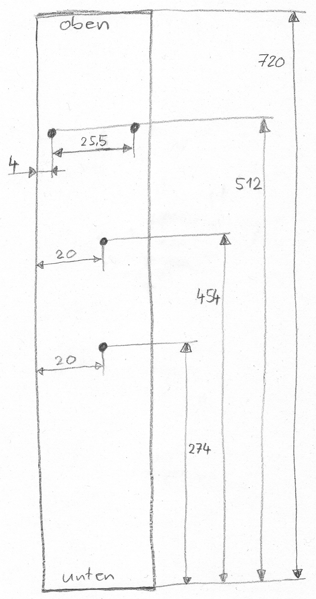

|build16|
Bohrplan Installationsplatte

Einbau
------

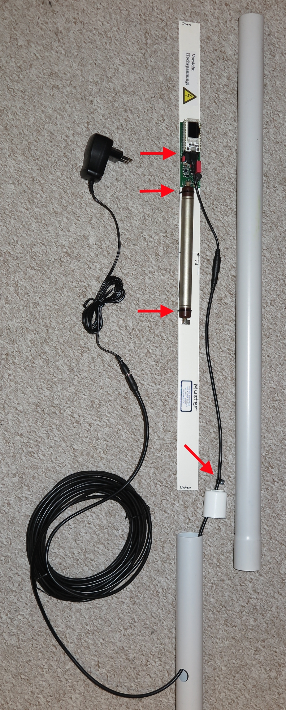

|build17|
Einbau des Geräts (die roten Pfeile markieren Kabelbinder)

* Platine und Zählrohr werden mit Kabelbinder auf die Installationsplatte montiert
* In die Micro-USB-Buchse wird der passende Adapter gesteckt
* Das „10 m Verlängerungskabel“ wird richtig herum zunächst durch den Erdspieß und dann durch den Zwischenboden gefädelt. Anschließend wird er mit dem Adapter verbunden
* Danach wird die Zwischenbodenauflage oberhalb des Zwischenbodens vorsichtig auf das Kabel geschoben
* Oberhalb der Zwischenbodenauflage wird ein Kabelbinder auf das Kabel gezurrt, so dass eine Zugentlastung entsteht
* Erster Test des Gehäuses: Wir schieben erst vorsichtig die Installationsplatte in das Elektronikgehäuse. Anschließend folgen Zwischenboden und der Erdspieß
* Wenn alles passt wird noch die Zwischenbodenauflage mit Silikon-Kleber auf den Zwischenboden geklebt und mit Kreppband (bis zum Aushärten) fixiert
* Der Warn-Aufkleber „Vorsicht Hochspannung“ wird auf die Installationsplatte geklebt

Inbetriebnahme
##############
WLAN-Variante: Das Gerät baut einen eigenen WLAN-Accesspoint (AP) auf. Die SSID des AP lautet ESP32-xxxxxxxx, wobei die xxx die Chip-ID des WLAN-Chips sind (Beispiel: ESP32-51564452). 
Bitte diese Nummer notieren, sie wird später für die Anmeldung benötigt, z. B. bei https://devices.sensor.community/. Der Access-Point bleibt für 30sec aktiv. Danach versucht das Gerät, sich mit dem (früher) eingestellten WLAN zu verbinden. 
Dieser Verbindungsversuch dauert ebenfalls 30 s. Kommt keine Verbindung zustande, wird wieder der eigene AP für erzeugt. Das standardmäßig vergebene WLAN-Kennwort ist „ESP32Geiger“ und sollte zeitnah geändert werden.

Weitere Informationen: :ref:`deployment` und :ref:`usage`.

**Wir wünschen viel Freude mit dem neu gebauten Gerät und hoffen dass es niemals unnatürliche bzw. gesundheitsschädliche Ausschläge messen wird!**