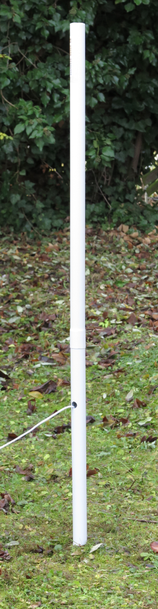
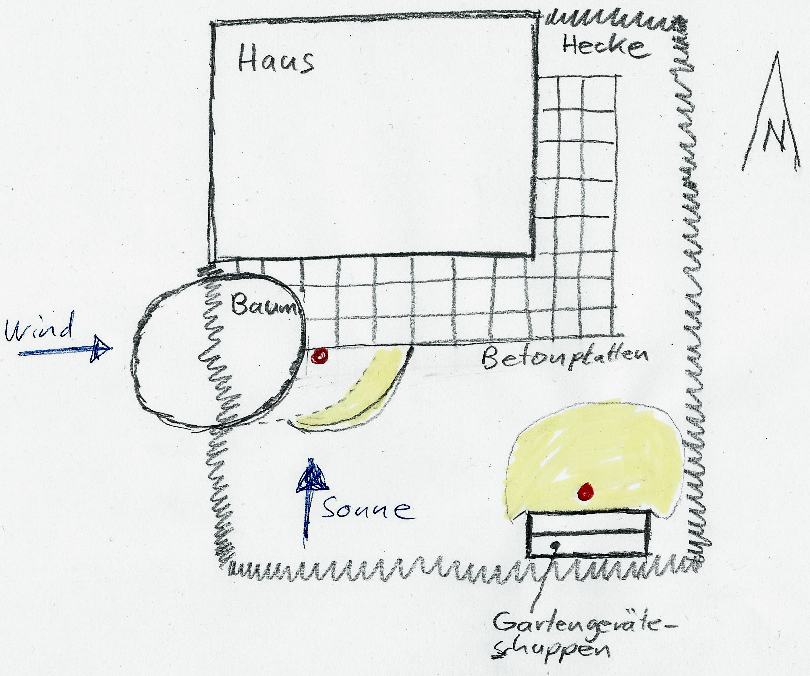

.. include:: global.rst.inc
.. highlight:: none
.. _deployment:

Deployment
==========

When deploying the MultiGeiger measurement station, you need to consider some things.

Of course, for us private persons, there rarely will be a 100% perfect deployment place.
But still, we can be aware of the parameters which may have a negative impact.

Requirements for the deployment place
#####################################

+--------------------------------------------------------------------------------------------+--------------------+
| In any case we need this at the deployment place:                                          |    |mg-garden|     |
|                                                                                            |                    |
| - WiFi or LoRa reception for data transmission (A)                                         |                    |
|                                                                                            |                    |
|   WiFi can come from inside the house, LoRa from some TTN LoRa gateway.                    |                    |
|                                                                                            |                    |
| - Power: 5 V / ~ 100 mA (B)                                                                |                    |
|                                                                                            |                    |
|   Power can come from inside the house via a 5V cable or from other power supply.          |                    |
|                                                                                            |                    |
| - Irrigation area (C)                                                                      |                    |
|                                                                                            |                    |
|   E.g. some lawn, meadow or similar that gets some rainfall, potentially including fallout.|                    |
+--------------------------------------------------------------------------------------------+--------------------+

Choosing a deployment place
###########################

We want to measure radioactive substances (dust), also known as "fallout".
They come from e.g. nuclear explosions or reactor desasters.

In a very weak variant, they also naturally come from the atmosphere due to the decay of the radioactive noble gas radon.
This "radon fallout" causes a small, but measurable peak on our devices, which degrades with a half life of 45 minutes.

With the help of these "radon peaks", we can see whether our device is deployed to a good place and is sensitive also for "real" fallout.

Irrigation area
---------------

We need a bigger irrigation area in the direct vicinity of the measurement station.
This area should also have the capability to hold and store radioactive particles.

A lawn or a meadow is perfect for this.

On the other hand, some asphalt can not do that, because particles are washed away directly after raining down. 

Wind direction
--------------

The area should be unobstructed from the main wind direction by other buildings, bushes or trees.

Sun light
---------

The power supply cable as well as the MultiGeiger device itself, should be in the shadows most of the time.

Direct sunlight can have two negative influences:

- Heat:
  The temperature inside the device can rise to up to 60 deg celsius in direct sunshine (45 deg celsius in the shadows).
  We did practical temperature tests showing that the device works ok up to 70 deg celsius.
  But the GM tube is only specified to up to 50 deg celsius.

- UV damage:
  Over time, the cable and case can be damaged by UV radiation and get porous.

Examples
########

Examples of good and bad deployment places:

|mg-placement|

Comparison of two deployment places. Yellow is the "usable irrigation area".

Bad deployment place (red dot at the left)

Reasons:

- Meadow: a bit part of the area around the GM device is made of concrete platter. Incapable of holding/storing fallout.
- Wind: the main wind direction is from the west and the tree obstructs fallout raining down close to the device.
- Sun: Sunlight comes primarily from the south and strongly shines on the devices.

Good deployment place (red dot at the right) 

Reasons:

- Meadow: a big part of the area around the GM device is meadow, which can hold/store fallout.
- Wind: no obstruction
- Sun: the GM device is in the shadow due to the garden shack.

More Information
################

Description of the BFS-ODL measurement network (german):

- `Messnetz <https://www.bfs.de/SharedDocs/Downloads/BfS/DE/broschueren/ion/radioaktivitaetsmessnetz.pdf?__blob=publicationFile&v=5>`_
- `ODL-Sonde <https://odlinfo.bfs.de/DE/themen/wie-wird-gemessen/odl-sonde.html>`_

Video interview about the BFS-ODL measurement network (german):

- `Interview über das BFS-ODL-Netzwerk <https://www.bfs.de/SharedDocs/Videos/BfS/DE/kt-interview-umweltueberwachung.html>`_
