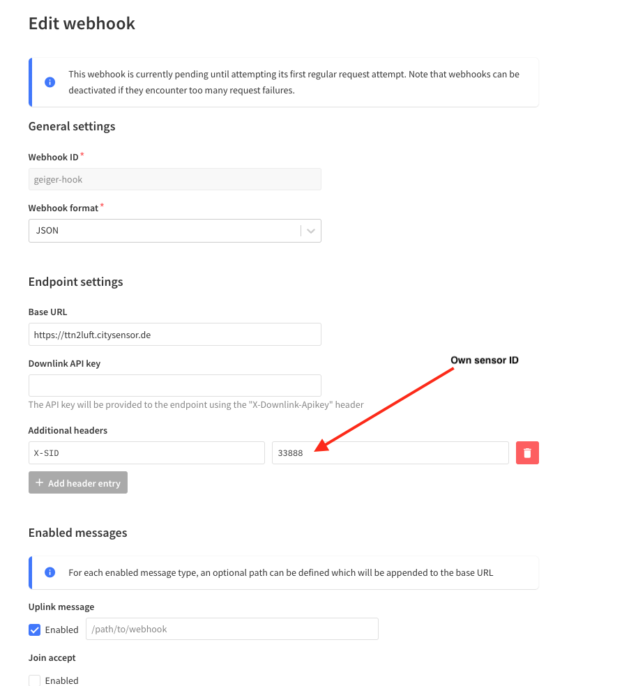

.. include:: global.rst.inc
.. _setup_lora:

Setup (LoRA)
------------

The MultiGeiger can be connected with the followng steps to TTN_V3 (“The
Things Network”):

-  Create the TTN device in your profile at *The Things Network*
-  Transfer the parameters to the MultiGeiger
-  Login at *sensor.community*
-  Webhook integration

Creating a TTN device
~~~~~~~~~~~~~~~~~~~~~

The device must be registered with TTN. To do this, an account must
first be created at TTN (if one does not already exist).

Create TTN account
^^^^^^^^^^^^^^^^^^

At https://account.thethingsnetwork.org/register you must enter a
**USERNAME**, the **EMAIL ADDRESS** and a **PASSWORD**. Then create the account by clicking on
**Create account**.  After that you can log in to
the console with the new data at
https://account.thethingsnetwork.org/users/login.

Create application
^^^^^^^^^^^^^^^^^^

After logging in click on your name (upper right corner) and select **Console**.
On the next screen select **Europe 1** and click on **Continue as <your name>**. Then select **Applications** from the top menue, 
after that click on **+ Add application** (right blue button).

The following fields must be
filled in:

**Owner:**
  This is prefilled with your login name and need not to be changed.
**Application ID:**
   Any name for this application, but it must not yet exist in the
   network (e.g.: geiger_20220105).
**Application name**  
  Choose an arbitrary name for your application.
**Description:**
   Any description of the application can be entered here.

Now create the application by clicking the **Create application** button.

Create device
^^^^^^^^^^^^^

On the next page you can now create a new device.  Press the button **+ Add end device**.
Now select **Manually** from the menue directly under **Register end device**.
Then the following fieds must be filled in:

**Frequency plan**
  Select **Europe 863-870 MHz (SF9) for RX2 - recommended)**.
**LoRaWan version**
  Select **MAC V1.02**.
**Regional Parameters version**
  Select **PHY V1.0.2 REV B**.

For each of the next three entries select **Generate** or **Fill with zeros**. Please write down these three values, 
you will need them later on.

The last field (**End device ID**) will be filled in automatically.
Now press **Register end device**.

Enter the LoRa parameters into the MultiGeiger
~~~~~~~~~~~~~~~~~~~~~~~~~~~~~~~~~~~~~~~~~~~~~~

-  After the registration was completed, the LoRa parameters need to be transferred to the MultiGeiger program.
-  These can be entered viat he configuration page of the MultiGeiger (see above).
-  Now go through the configuration on the configuration page until the settings of the LoRa  parameters are displayed
   and enter them here. Type in the 3 parameters from the TTN console (**APPEUI, DEVEUI, APPKEY**). 
   
   Enter the HEX values  **without** spaces as they appear in the TTN. Example:

The TTN console reads

::

   Device EUI    00 D0 C0 00 C3 19 7C E8

Then the following must be entered:

::

   00D0C000C3197CE8

This is also applies to **APPEUI** and **APPKEY** .

Logging data to sensor.community
~~~~~~~~~~~~~~~~~~~~~~~~~~~~~~~~
If you want to transfer the data from Multigeiger to sensor.community, you have to 
register at sensor.community. The registration process is similar to the description 
above ("Login to sensor.community").  In the following, only the changes are
explained:

**Sensor ID:**
   Enter the last 4 bytes of the DEVEUI in left to right order (e.g. if
   the DEVEUI is *00 D0 C0 00 C3 19 7C E8*, so enter *C3197CE8*), but
   converted to decimal, not in HEX (finally: 3273227496).
**Sensor Board:**
   Select **TTN**, to select use the small arrow on the right.

Webhook integration
~~~~~~~~~~~~~~~~~~~~

To get the data via TTN to *sensor.community* , the Webhook integration at TTN has to be activated.

At the Application tab select **Integrations** from the left menue. Select **Webhooks**, then **+ Add webhook**. 
Scroll down and select **Custom webhook**.

Fill in the following fields:

**Webhook ID**
  Enter an arbitrary name for this hook
**Webhook format**
  Select **JSON**
**Base URL**
  Enter **https://ttn2luft.citysensor.de**
**Downlink API key**
  This remains empty

Then click at **+Add header entry** to add a special Header. Enter **X-SID** in the left field and your 
sensor id (the number, you received from sensor.community, **not** the chip ID) in the right field.
Enable **Uplink message**, all other selections remain disabled. Now click **save changes**.

See this example of what the form should look like:

TTN payload (example)
~~~~~~~~~~~~~~~~~~~~~

In order to get readable values in the TTN console instead of solely data bytes, a small script can be inserted as payload decoder.
Go to the TTN website, log in, click **Applications** to find the application you created above. 
From the left menu select **Payload formatters** and then **Uplink**.

At **Formatter type** select **Javascript** and in **Formatter paramater** paste following code (replace existing code):

::

  function decodeUplink(input) {
    var data = {};
    if(input.fPort === 1) {
      var minor = (input.bytes[7] & 0xF) + (input.bytes[8] >> 4) ;
      data.counts = ((input.bytes[0] * 256 + input.bytes[1]) * 256 + input.bytes[2]) * 256 + input.bytes[3];
      data.sample_time = (input.bytes[4] * 256 + input.bytes[5]) * 256 + input.bytes[6];
      data.tube = input.bytes[9];
      data.sw_version = "" + (input.bytes[7] >>4 ) + "." + minor + "." + (input.bytes[8] & 0xF);
    }
    if(input.fPort === 2) {
      var t = input.bytes[0] * 256 + input.bytes[1];
      if (input.bytes[0] & 0x80) {
        t |= 0xFFFF0000;
      }
      data.temp = t / 10 + "°C";
      data.humidity = input.bytes[2] / 2 + "%";
      data.press = ((input.bytes[3] * 256 + input.bytes[4]) / 10 ) + "hPa";
    }
    return  {
      data: data,
      warnings: [],
      error: []
    };
  }

