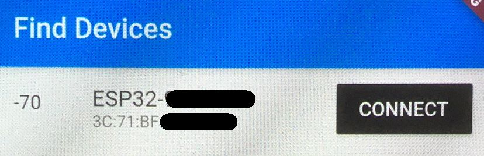
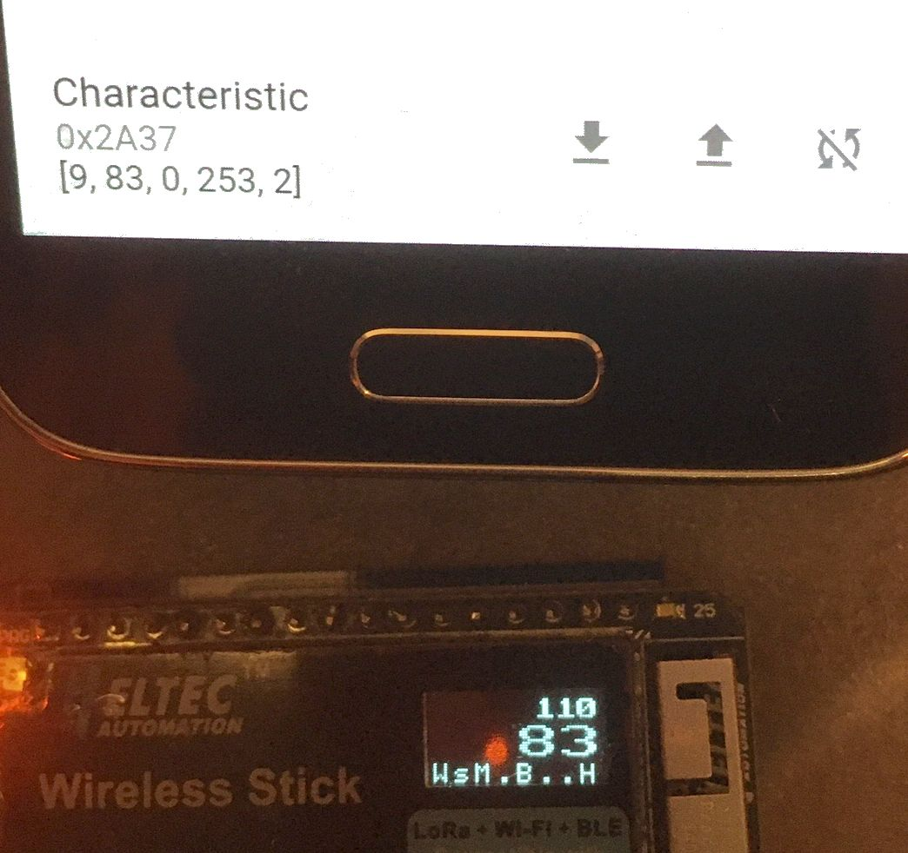

.. include:: global.rst.inc
.. highlight:: none
.. _usage:

Usage
=====

OLED display
############

Top line
--------

Left: Time since power-on (not shown on small displays).

Right: Overall average radiation since power-on.

Middle area
-----------

Current CPM (counts per minute) displayed using a rather big font.

Bottom line
-----------

This is a status display with 8 positions, numbered 0..7:

Rules of thumb:

- ``.`` usually means "off" or "unused".
- if you see some *number* (``0`` .. ``7``) within the status display line, something went wrong.

Positions:

- 0: WiFi

  - ``A``: AccessPoint active
  - ``w``: WiFi client trying to connect
  - ``W``: WiFi client connected
  - ``0``: some error happened
- 1: sensors.community transmission

  - ``.``: off (not configured / enabled)
  - ``?``: init (enabled, before 1st transmission)
  - ``S``: sending
  - ``s``: idle (shown after successful sending)
  - ``1``: sending failed (shown after trying to send)
- 2: madavi transmission

  - ``.``: off (not configured / enabled)
  - ``?``: init (enabled, before 1st transmission)
  - ``M``: sending
  - ``m``: idle (shown after successful sending)
  - ``2``: sending failed (shown after trying to send)
- 3: TTN ("The Things Network")

  - ``.``: off (not configured, not enabled, no LoRa hardware)
  - ``?``: init (enabled, before 1st transmission)
  - ``T``: sending
  - ``t``: idle (shown after successful sending)
  - ``3``: sending failed (shown after trying to send)
- 4: BLE (Bluetooth® Low Energy)

  - ``.``: off (not enabled)
  - ``?``: init (enabled, before setup of BLE service)
  - ``B``: connected and sending notifications, if requested by connected device
  - ``b``: connectable (advertising and ready to connect)
  - ``4``: BLE error
- 5: unused
- 6: unused
- 7: High-Voltage Capacitor charging

  - ``H``: OK
  - ``7``: failure to charge HV capacitor

BLE - Bluetooth® Low Energy
###########################

BLE Heart Rate Service
----------------------

The MultiGeiger, starting from firmware version 1.15.0-dev, provides a Bluetooth® Low Energy (BLE) service to collect the count rate via a `GATT Heart Rate Service <https://www.bluetooth.com/specifications/gatt/services/>`_ (Service UUID 0x180D). The following characteristics are used:

- 0x2A37 ('Heart Rate Measurement Characteristic'):

  - First byte are status flags, according to the service's standard
  - 'Heart Rate Measurement' as 16 bit value (little endian), corresponds to Geiger-Müller counts per minute (CPM)
  - 'Energy Expenditure' as 16 bit value (little endian), represents a rolling packet counter
- 0x2A38 ('Heart Rate Sensor Position Characteristic')

  - Single byte with TUBE-TYPE value, to convert CPM to radiation rate
- 0x2A39 ('Heart Rate Control Point Characteristic')

  - Write characteristic, required by service's standard to reset Energy Expenditure to 0. Writing 0x01 reset rolling packet counter to 0.

Testing BLE
-----------

Any decent Bluetooth® scanning app should be able to connect to the device and show the notification values.
Known to work well is the nordic® nRF Connect app, which should be available for iOS and Android.
More infos about the Android app can be found `here on github <https://www.nordicsemi.com/Software-and-Tools/Development-Tools/nRF-Connect-for-mobile>`_.

Any heart monitor app / device should be able to connect to the MultiGeiger, too, but that was not tested yet. Any input is appreciated.

- Figure 1: Connect to the MultiGeiger with the name 'ESP32-<id>', where <id> should be the same ID (7 to 8 digits) than the access point to set the device up initially.

- Figure 2: Find the correct service (UUID 0x180D) and, if needed, load / open characteristics.

- Figure 3: Find the Heart Rate Measurement Characteristic (UUID 0x2A37) and click on the icon to start notifications.

.. |ble2| image:: ../../images/ble_check02.jpg
   :width: 250px
   :align: top

+----------+----------+----------+
| *Fig. 1* | *Fig. 2* | *Fig. 3* |
|          |          |          |
| |ble1|   | |ble2|   | |ble3|   |
+----------+----------+----------+

